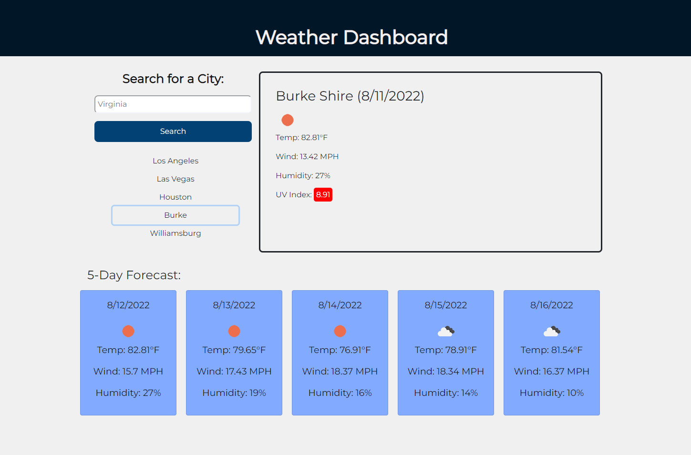

# Server-Side APIs: Weather Dashboard

## Description

User can type in a city name above search button on the left side of the page. After clicking the search button, current weather will be displayed as well as the 5-day forecast. Weather information includes: temperature, wind speed, humidity, and UV-index. Previous searches will be visible below the search button, so that the user can access them again if needed.

## Table of Contents

- [App's Snapshots](#screenshots)

- [Links](#links)

- [Contact](#contact)

## Screenshots

## Links

Deployed app: https://catcueto.github.io/weather-dashboard/

## Contact

Hey! If you want to connect or have any questions about this repository, please contact me directly at catacueto@gmail.com

You can find more of my work at https://github.com/catcueto
